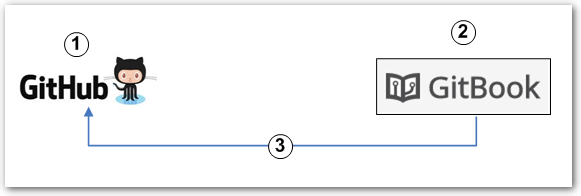
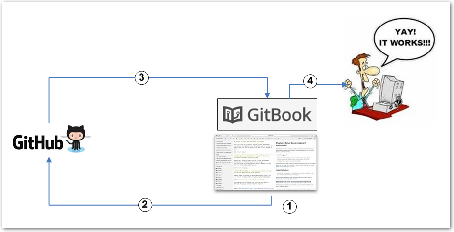
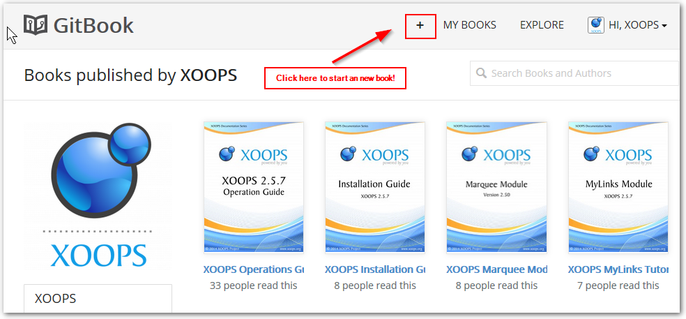
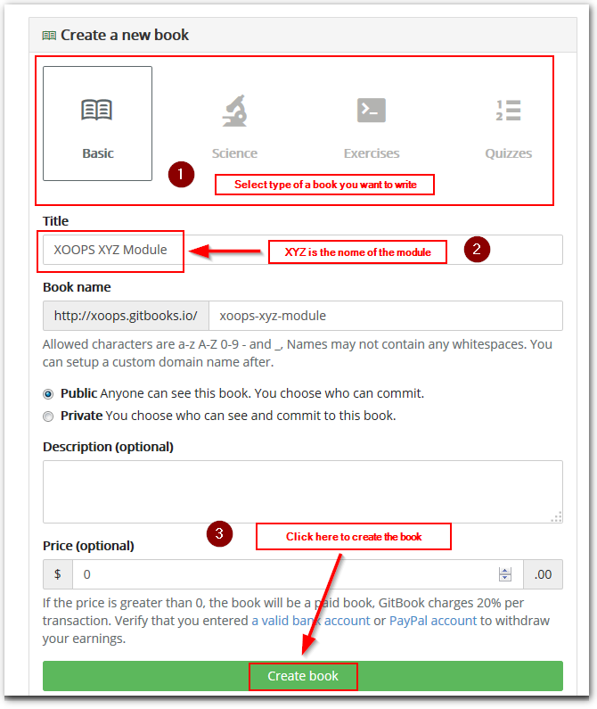
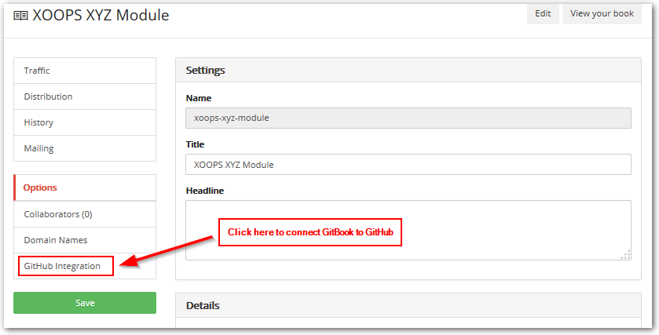

# ch3

## 1\) Setup

1. Erstelle ein GitHub-Verzeichnis für Dein Buch \(forke ein bestehendes oder erstelle ein neues\)
2. Erstelle ein Buch auf GitBook
3. In den Einstellungen zu Deinem Buch kannst Du dieses mit dem GitHub-Verzeichnis verknüpfen

## 2\) Schreiben und Veröffentlichen eines Buches

1. Schreibe ein neues Buch oder bearbeite ein existierendes mit Hilfe des GitBook-Editors
2. Bei jeder Speicherung Deine Arbei im Editor werden auch alle Änderungen im GitHub-Verzeichnis gespeichert
3. Sofern Du einen GitBook-Webhook für Dein Verzeichnis verwendest, wird jede Übertragung von Änderungen in das GitHub-Verzeichnis auch dazu führen, das GitBook eine aktualisierte Version Deines Buches veröffentlicht.

>  **HINWEIS:** Webhooks erlauben, dass externe Services über bestimte Ereignisse auf GitHub informiert werden. Wenn ein definiertes Ereignis stattfindet, sendet GitHub einen POST-Request an alle von Dir festgelegten Urls. Lerne mehr über Webhooks im [Webhooks Guide](https://developer.github.com/webhooks/). 4. Durch diesen automatischen Update haben die Leser immer Zugriff auf die letzte und somit aktuellste Version Deines Buches

## 3\) Detaillierte Schritte

1. Stelle sicher, dass Du einen GitHub-Account besitzt und dass unter [**XOOPS Publication**](https://github.com/XoopsDocs/) das Buch, das Du bearbeiten möchtest, verfügbar ist
2. Gehe zum entsprechenden Buch im XOOPS Publication-Verzeichnis und klicke auf die Schaltfläche Fork: \([screenshot](http://mrm-screen.s3.amazonaws.com/MrMaksimizegitbookstarterkit_20140707_085000_20140707_085006.png)\)
3. Benenne das Verzeichnis so um, wie Du dies gerne haben möchtest:
   * Klicke auf Einstellungen auf der Übersichtsseite Deines Fork-Verzeichnisses \(durch das Forken wird eine Kopie des Originalverzeichnisses unter Deinem Namen erstellt\). \([screenshot](http://mrm-screen.s3.amazonaws.com/MrMaksimizegitbookstarterkit_20140707_100321_20140707_100325.png)\)
   * Wenn gewünscht, dann benenne den Namen Deines Verzeichnisses um \([screenshot](http://mrm-screen.s3.amazonaws.com/Options_20140707_100417_20140707_100421.png)\)
4. Wenn Du das Dokument lokal bearbeiten möchtest, dann klone Dein Verzeichnis auf Deinen Rechner. Für Windows-Benutzer steht [GitHub for Windows](https://windows.github.com/) zur Verfügung, welches sehr hilfreich sein kann. Du must nur auf die "Klonen"-Schaltfläche klicken, und GitHub übernimmt den Rest für Dich. Natürlich kannst Du auch Deine persönliche Art der Interaktion mit Git verwenden, inklusive der Verwendung von Kommandozeilen.
5. Nun gehe zurück zu GitBook und klicke auf das "+"-Symbol im oberen Bereich:

welches diesen Bildschirm öffnet: [https://www.gitbook.com/new](https://www.gitbook.com/new)

1. Wähle die Art des Buches, das Du schreiben möchtest. Im Falle von XOOPS verwenden wir das Standardbuch
2. Wähle den Buchnamen. Für XOOPS Tutorials verwenden wir "**XOOPS XYZ Module**", wobei **XYZ** den Namen des Modules darstellt, z.B. "**XOOPS Protector Module**"
3. Klicke auf die "Speichern" Schaltfläche

1\) Nachdem das Buch erstellt wurde, benötigen wir eine Verbindung zum GitHub-Verzeichnis, welche über Einstellungen erstellt wird. Bitte beachte, dass über diese GitBook-Oberfläche über die Schaltflächen "Edit" oder "Read" auch bearbeitet bzw. angezeigt werden kann.

Nach einem Klick auf Einstellungen \(Settings\) klicke bitt auf "GitHub Integration"

1. Zum Verbinden des Buches mit dem GitHub-Verzeichnis gib Deinen Account-Namen sowie den GitHub-Verzeichnisnamen an \(z.B. **XoopsDocs/xyz-tutorial**\)
2. Wenn Du möchtest, dass GitBook bei jeder Änderung im Verzeichnis auch die Ausgabeversion ändert, so musst Du hier den "Webhook" angeben
3. Speichere Deine Einstellungen
4. Ab jetzt kannst Du nach einem Klick auf die Edit-Schaltfläche mit dem Schreiben Deines Buches beginnen! 

