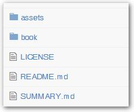
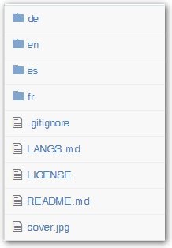

# Dokumentations-Standards

1) Bitte verwende die Standardschreibweisen für die Erstellung einer Dokumenation mit Markdown, schau Dir erforderlichenfalls bestehende XOOPS-Dokumente als Beispiel an

2) Bitte achte darauf, dass Dein Dokument von Anfang an mehrsprachig aufgebaut ist

3) Bitte verwende nachstehende Standards für die Angabe von Infos/Tipps:


> **TIPP:** Die Bilder besitzen keine Tooltip-Information.

> **BEACHTE:** Die Bilder besitzen keine Tooltip-Information.

> **ACHTUNG:** Die Bilder besitzen keine Tooltip-Information.

> **WICHTIG:** Die Bilder besitzen keine Tooltip-Information.

4) Beim Erstellen eines XOOPS-Tutorials in GitBook benenne es wie folgt: **"XOOPS XYZ Module"**, ersetze "XYZ" durch den Namen des Moduls, z.B. "XOOPS Protector Module"

5) Verzeichnisstruktur

  

Hier kanns Du die typische Verzeichnisstruktur für ein Gitbook-Dokument sehen. Innerhalb des /book-Ordners kannst Du zusätzliche Unterordner je anch Bedarf anlegen (z.B. für die verschiedenen Kapitel)

Für mehrsprachige Dokumente sieht die Struktur wie folgt aus:

 

Die Datei LANGS.md enthält eine Liste aller Sprachen die (de-)aktiviert werden können:
```markdown
* [English](en)
* [Deutsch](de)
* [Español](es)
* [Français](fr)

<!--
* [Português](pt-br)
* [Italiano](it)
* [العربية](ar)
* [azərbaycan dili](az)
* [беларуская мова](be)
* [català](ca)
* [čeština, český jazyk](cs)
* [Esperanto](eo)
* [suomi](fi)
* [हिन्दी, हिंदी](hi)
* [Magyar](hu)
* [Bahasa Indonesia](id)
* [日本語 (にほんご)](ja)
* [한국어, 조선어](ko)
* [македонски јазик](mk)
* [Nederlands](nl)
* [język polski](pl)
* [limba română](ro)
* [русский язык](ru)
* [српски језик](sr)
* [ไทย](th)
* [Türkçe](tr)
* [Tiếng Việt](vi)
* [漢語](zh-tw)
* [中文](zh)
-->
```
Bitte beachte, dass alle aktiven Sprachen den Leser in einer Auswahl zur Verfügung gestellt werden, wenn sie Dein Dokument lesen wollen.

5) Bitte beachte, dass die Struktur für jede Sprachversion eines Buches wie folgt ist:

- README.md ist die Einleitungsdatei
- SUMMARY.md ist das Inhaltsverzeichnis, das auf der linken Seite alle Links zu den verfügbaren Inhalten anzeigt

