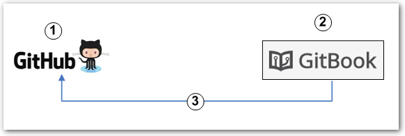
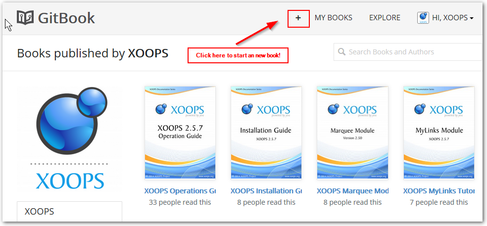
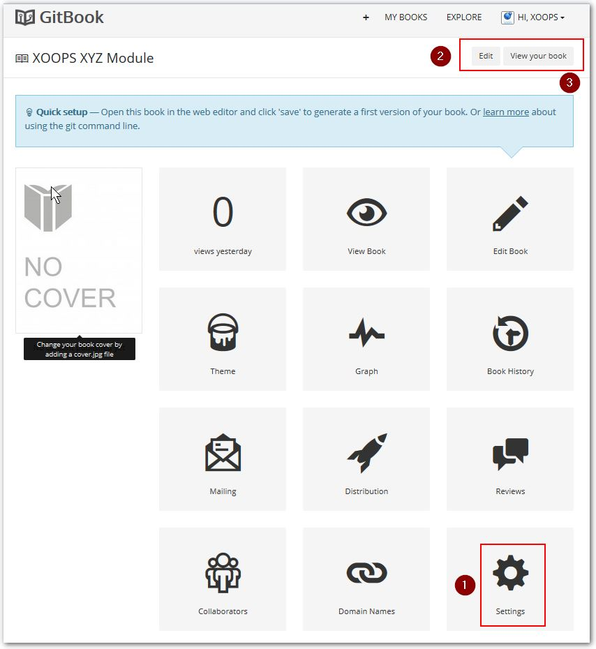
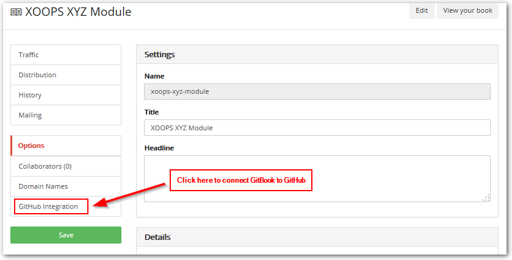
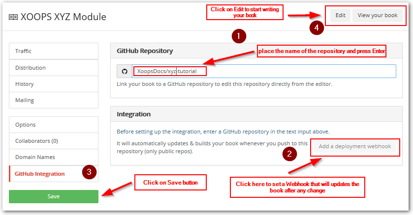

# Process workflow

### 1) Setup

1. Create a GitHub repository for your book (fork existing or create a new one)
2. Create the book on GitBook
3. In the book's Settings, connect the book to the GitHub repository

### 2) Writing and publishing a book

1. Write a new book or edit an existing one using the GitBook Editor 
2. Every time you save your work in the Editor, it will be saved in the GitHub repository.
3. If you have set a GitBook webhook to the repository, every time you commit your work to GitHub repository, it will trigger GitBook to re-publish the book  
> **NOTE:** Webhooks allow external services to be notified when certain events happen on GitHub. When the specified events happen, GitHub will send a POST request to each of the URLs you provide. Learn more in the [Webhooks Guide](https://developer.github.com/webhooks/).
4. The user will then have automatically access to the latest and greatest version of your book

### 3) Detailed steps

1. Make sure you have a GitHub account and there is an available **[XOOPS Publication](https://github.com/XoopsDocs/)** that you want to contribute to
* Go to the publication's repository and click on the Fork Button: ([screenshot](http://mrm-screen.s3.amazonaws.com/MrMaksimizegitbookstarterkit_20140707_085000_20140707_085006.png))
* Rename the repo to what you want your book to be called:
  * Click settings from the home screen of the forked repo (forking creates a copy of the repository under your username). ([screenshot](http://mrm-screen.s3.amazonaws.com/MrMaksimizegitbookstarterkit_20140707_100321_20140707_100325.png))
  * Rename the repo if needed  ([screenshot](http://mrm-screen.s3.amazonaws.com/Options_20140707_100417_20140707_100421.png))
* Clone the repo to your machine, if you want to work on the document locally. For Windows users there is the [GitHub for Windows](https://windows.github.com/), which can be very helpful. You just need to click the "Clone" button on your GitHub repository screen, and GitHub will take care of the rest.
Of course, you can also use your favorite way of interacting with Git, incl. the command line. 
* Now go to GitBook and click on the "+" sign there on top: 

which will open this screen: https://www.gitbook.com/new below:

1. Select the kind of book you want to write. In our case, the Basic book is what we're using
2. Set the name of the book. For XOOPS Tutorials, we're using "XOOPS XYZ Module", where XYZ is the name of the module, e.g. "XOOPS Protector Module"
3. Click then on the "Save" Button

1) After the book has been created, we need to connect it to the GitHub repository via the Settings. Please note that from this screen we can also click on the top buttons to Edit or View the book

After we click on the Settings, we click on the "GitHub Integration" button

1. To connect the book to the GitHub Repository, we enter the name of the Account and the repository on GitHub (e.g. XoopsDocs/xyz-tutorial)
2. If we want GitBook to update the book every time the repository is changed, we need to add the "webhook" by clicking on the link here
3. Let's save the Settings, just in case
4. From here, we can now click on the Edit button and start writing our new book! 

