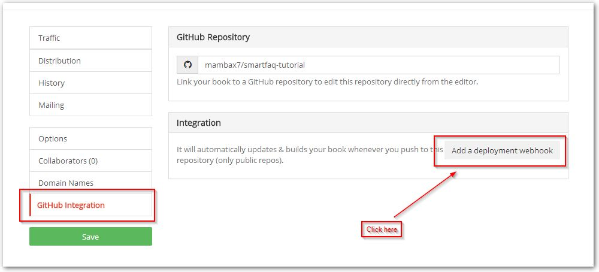
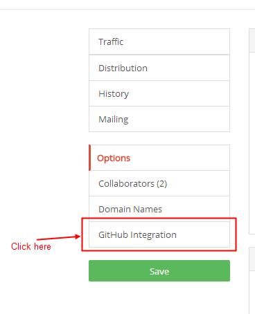
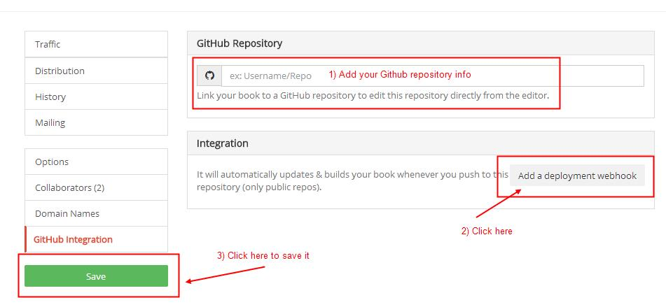

# Process workflow

### 1) Setup

1. You need to set up a GitHub repository for your book 
2. Create the book itself on GitBook
3. In the book's Settings, connect the book to the GitHub repository

### 2) Writing and publishing a book

1. Start write or edit your book using the GitBook Editor 
2. Every time you save your work in the Editor, it will be saved in the GitHub repository.
3. If you have set a GitBook webhook to the repository, every time you commit your work to GitHub repository, it triggers GitBook to re-publish the book  
> **NOTE:** Webhooks allow external services to be notified when certain events happen on GitHub. When the specified events happen, GitHub will send a POST request to each of the URLs you provide. Learn more in the [Webhooks Guide](https://developer.github.com/webhooks/).
4. The user will have automatically access to the latest and greatest version

### 3) Detailed steps

* Make sure you have a GitHub account and there is an available **[XOOPS Publication](https://github.com/XoopsDocs/)** that you want to contribute to
* Go to the publication's repository and click on the Fork Button: ([screenshot](http://mrm-screen.s3.amazonaws.com/MrMaksimizegitbookstarterkit_20140707_085000_20140707_085006.png))
* Rename the repo to what you want your book to be called:
  * Click settings from the home screen of the forked repo (forking creates a copy of the repository under your username). ([screenshot](http://mrm-screen.s3.amazonaws.com/MrMaksimizegitbookstarterkit_20140707_100321_20140707_100325.png))
  * Rename the repo ([screenshot](http://mrm-screen.s3.amazonaws.com/Options_20140707_100417_20140707_100421.png))
* Clone the repo to your machine.  Remember our assumptions.  I will walk through how I would do it:
  * Find the URL of the new forked repo. ([screenshot](http://mrm-screen.s3.amazonaws.com/MrMaksimizegitbookstarterkit_20140707_085400_20140707_085418.png))
  * Open terminal back up and execute the following:
  * `git clone YOUR_REPO_URL ~/Code/BookName`
  * `cd ~/Code/BookName`
  * `gitbook serve`
  * The last command will start a local server at port 4000 which you can access at http://localhost:4000;  It will automatically refresh on changes.  Now you're ready to start writing!

