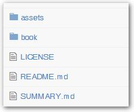

# Documentation Standards

1) Please use the standard way of writing documentation using Markdown, and review the existing XOOPS Documents as examples

2) Please consider making your documents Multi-lingual from the very beginning

3) Please use following standards for Info/Tips:

> **TIP:** These images below do NOT have tool tip information.

> **NOTE:** These images below do NOT have tool tip information.

> **WARNING:** These images below do NOT have tool tip information.

> **IMPORTANT:** These images below do NOT have tool tip information.

4) Directory structure

  

Above you can see the typical directory structure for a Gitbook document. Within the /book folder, you can have additional folders if needed (e.g. for individual chapters)

 